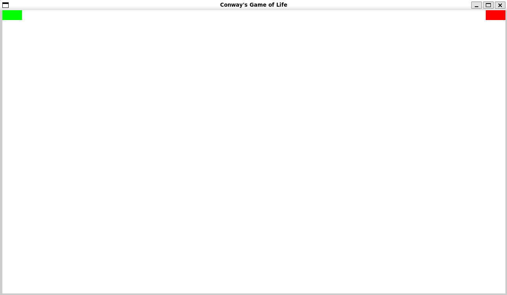

# 1. Introduction
Conway's Game of Life (also known as Life) is a Cellular Automaton, discrete computational model, created by British Mathemetician John Horton Conway. 
Game of Life is a Zero Player Game, which means that the progression of the game only depends on the initial state set by the player.

## 1.1 Rules
Life is composed of a 2 dimensional infinite plane filled with cells.
Each cell is represented as a square and is either alive (black) or dead (white).
After each tick of gametime, every cell on the plane will determine how many of its neighbor cells are alive.
The number of neighbor cells which are alive will then determine if the initial cell will live, die, or be born based on 4 pre-set rules.

1. "Any live cell with fewer than two live neighbours dies, as if by underpopulation."
2. "Any live cell with two or three live neighbours lives on to the next generation."
3. "Any live cell with more than three live neighbours dies, as if by overpopulation."
4. "Any dead cell with exactly three live neighbours becomes a live cell, as if by reproduction."

It is important to note that all cells, regardless if they are alive or dead, check the 4 conditions above at the same time. 
At the start of the new tick, the status of all cells on the board updates at once. 

For more information, check out [this Wikipedia article](https://en.wikipedia.org/wiki/Conway%27s_Game_of_Life). 
Additionally, check out the list of cool example videos below.

* [An Introduction to Conway's Game of Life](https://www.youtube.com/watch?v=ouipbDkwHWA&t=206s)
* [Epic Conway's Game of Life](https://www.youtube.com/watch?v=C2vgICfQawE&t=126s)
* [Life in Life](https://www.youtube.com/watch?v=xP5-iIeKXE8)
* [Fractals in Conway's Game of Life](https://www.youtube.com/watch?v=I6GZ_ZtYBKE)

# 2. How to Play

## 2.1 Installation
1. Ensure that Python is installed on your system.
2. Clone this Git repository or download the source code as a zip file and extract.
3. Navigate to the directory you downloaded the source code.
4. Once in the root directory, install packages with the `pip` package manager. This can be done with `python -m pip install -r requirements.txt`.

## 2.2 Starting the Game
1. In the root directory of the project, type `cd src` to move into the source code directory.
2. Once in the source code directory, run the game by typing `python main.py`. This should bring up the starting screen of the game.

## 2.3 The Drawing Screen
When the game first starts up, you will load into the drawing screen. The drawing screen is where you can customize the starting state of the game.

